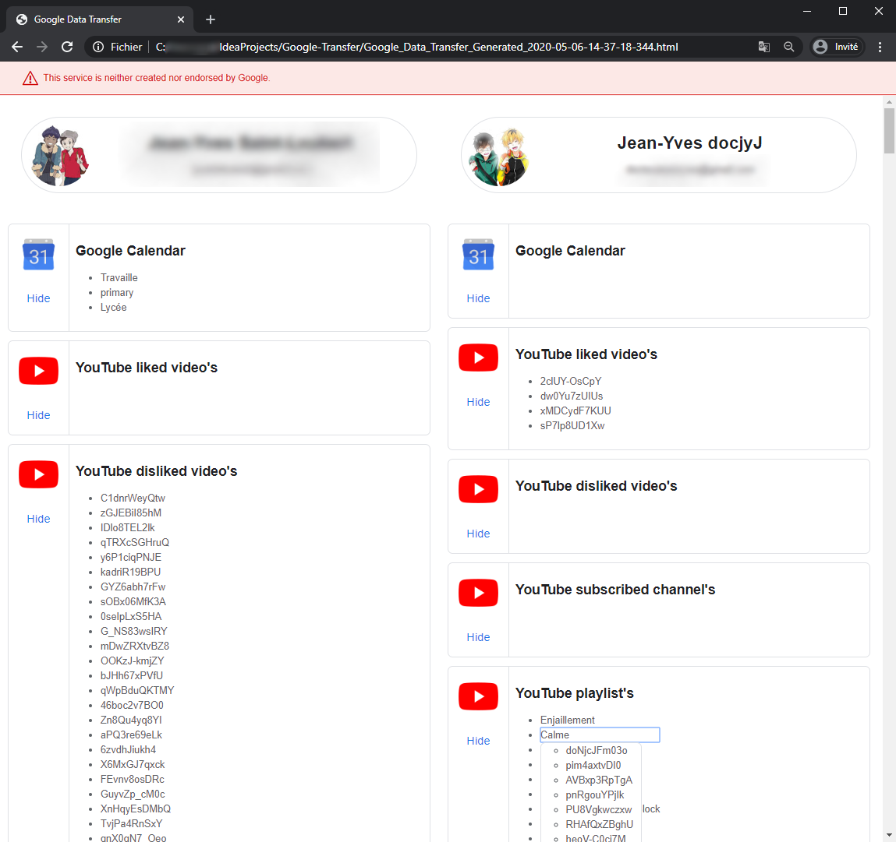

# Google-Transfer
Transfer Google data from one account to another.

## Transferable data and service
* YouTube **(works, but API quota's is limited)**
    * liked videos
    * disliked videos
    * subscribed channels
    * playlists
* Google Calendar **(some timeout problem with API)**
    * calendar and events

### Work in progress
* Contacts
    * contacts
* Gmail
    * filters
    * settings
* Google Drive
    * clone files
* Google Fit
    * clone files

## Prerequisite
Have a Client Secrets Json file for Google OAuth 2.0 with apis :
- Gmail API
- Google Calendar API
- Google Drive API
- People API
- YouTube Data API v3
> More information : https://developers.google.com/identity/protocols/oauth2

## Install and Run
1. Download the project
2. Put the `client_secrets.json` file in `src/main/resources/`
3. Run file `run.bat`

## Picture Example

### Data display

